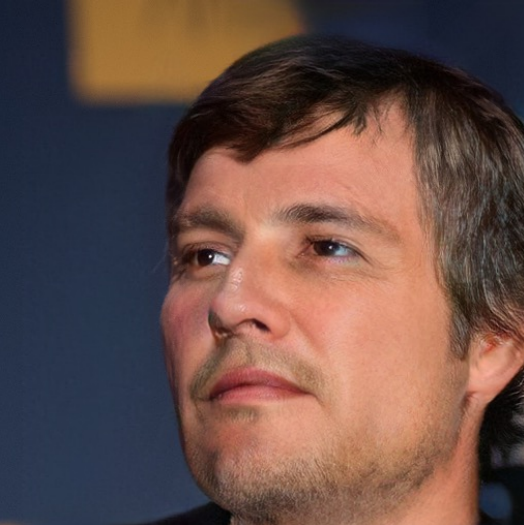
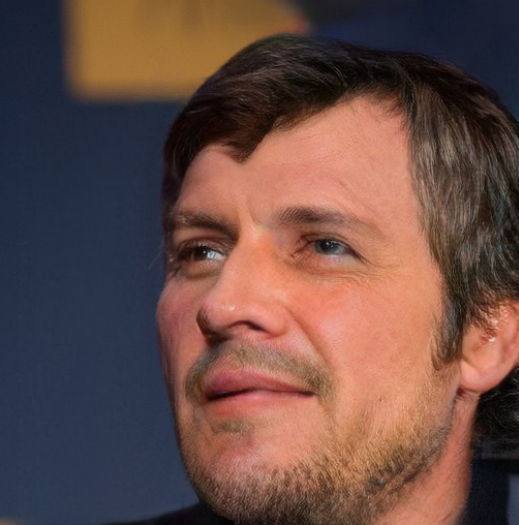
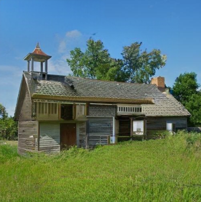
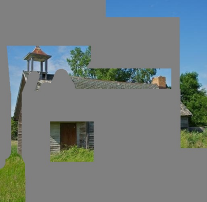
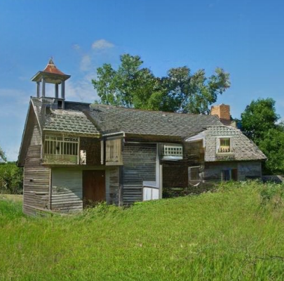

# 基于深度学习的图像修复算法

**PS：模型使用开发环境CUDA（v.11.7）、PyTorch（v.2.0.1）、Python（v.3.8.0）进行模型构建。**

### 模型使用方式：

- 到百度网盘下载预训练文件，下载后将其放到pretrained文件夹下(如果过期联系作者即可)

  ```
  链接：https://pan.baidu.com/s/1Y1wTuiAAu9AU3ruvjv17XQ?pwd=imgf 
  提取码：imgf
  ```

- 下载代码后cd到代码根目录，然后通过pip安装requirements.txt内的环境依赖（如果太慢请换源，在后面加上下面第二行所示的代码）

  ```
  pip install -r requirements.txt
  -i https://pypi.tuna.tsinghua.edu.cn/simple（清华源）
  ```

- 在代码根目录下输入

  ``` 
  python generate_image.py --network pretrained/CelebA-HQ_512.pkl --dpath test_sets/CelebA-HQ/images --mpath test_sets/CelebA-HQ/masks --outdir samples
  ```

  上面这段运行命令是用test_sets/CelebA-HQ/images作为待修复图片，test_sets/CelebA-HQ/masks作为覆盖在图片上面的膜，并使用训练好的CelebA-HQ_512.pkl模型进行图像修复，结果保存在samples文件夹内，打开即可看到修复后图。

- **注意：** test_sets/CelebA-HQ/images和 test_sets/CelebA-HQ/mashks两个文件夹内的待修复原图和代表破损位置的mask掩膜数量一定要匹配不然无法运行（已经有两张图可以用来测试，如果想测试其他图片，可以下载下面CelebA-HQ公开数据集）。另外，github连接只提供训练好的模型和使用代码，不提供训练用代码，如果需要模型源码请联系作者。

### 作者联系方式

- VX：Accddvva
- QQ：1144968929
- CSDN：https://blog.csdn.net/qq_45566099?spm=1011.2415.3001.5343
- 作者于浙江大学计算机科学与技术学院攻读博士学位

### Abstract

​	在图像获取和传输过程中，往往**伴随着各种形式的损坏**，降低了图像质量和对图像信息的准确解释，一些老照片因为保存不当也会变得存在污渍或者破损缺失。图像修复技术主要用来修复日常生活中被噪声污染或者人为破坏的破损图像，也可应用于**替换图像中的小区域或者瑕疵**。目前，图像修复工作仍然由经验丰富的图像修复师来完成，让图像修复借助深度学习算法实现自动化日趋成为该领域的发展方向。本课题基于深度学习算法和图像处理技术，设计并开发一款**图像修复深度学习算法程序**，**该程序能够对使用者上传的照片进行自动分析，根据用户需要修复照片损坏部分，提高照片的清晰度和观赏性。**

- 概述
		最近的研究表明，在图像修复问题中建立远程相互作用模型具有很高的重要性。为了实现这一目标，现有的方法要么利用独立注意力技术，要么利用Transformer。但是，考虑到计算成本，并且通常需要修复低分辨率下的图像。本课题提出了一种新的基于Transformer和卷积的图像修复模型，该模型能够有效处理高分辨率图像。
	具体来说，我设计了一个面向绘画的Transformer，并结合卷积的上下采样和图像风格迁移技术来实现缺失或者模糊图像的修复。
		该模型由以下几个主要部分组成：卷积头、Transformer、卷积尾和风格迁移模块。 卷积头负责从输入图像和掩码中提取视觉标记。它包括四个3*3卷积层，用于更改图像维度和下采样。Transformer是模型的主要组成部分，由五个不同分辨率的Transformer组成。使用多头情境注意力对长距离互动进行建模。 卷积尾用于对输出标记的空间分辨率进行上采样以匹配输入大小。风格迁移模块旨在实现多元化生成并增强输出的多样性。它通过使用额外的噪声输入在重建过程中更改卷积层的权重归一化来操纵输出。该模块还结合了图像条件样式和无噪声样式，以增强噪声输入的表示能力。

### 模型演示（分控制台演示和另外开发的QT界面展示）：
- 通过QT界面演示
- （bilibili连接）https://www.bilibili.com/video/BV13t421b77k/?spm_id_from=333.999.0.0

### 通过控制台（终端）界面演示：
- （bilibili连接）https://www.bilibili.com/video/BV1Sx4y1k7cQ/?spm_id_from=333.999.0.0&vd_source=564177318e842069eddc2a6ed44f73f6

### 训练用数据集
- **人脸**公开数据集**CelebA-HQ**：链接：https://github.com/tkarras/progressive_growing_of_gans
制作机构：Tero Karras, Samuli Laine, Timo Aila 和 NVIDIA 的研究人员制作
- **场景（风景）**公开数据集**Places2**：链接：http://places2.csail.mit.edu/download.html
制作机构：斯坦福大学和微软研究院共同制作
- **街景**公开数据集**Paris StreetView**：链接：http://opendata.paris.fr/explore/dataset/photos-de-rue-a-paris/
制作机构：巴黎市政府
- **纹理**公开数据集**DTD**：链接：http://www.robots.ox.ac.uk/~vgg/data/dtd/。
制作机构：英国牛津大学计算机视觉研究团队
- **建筑**公开数据集**Façade**：链接：
GitHub上的项目：https://github.com/shannontian/facade-parsing
官方网站：CMP Facade Database
数据集共享平台：https://www.vision.ee.ethz.ch/datasets_extra/facade/
制作机构：Czech Technical University in Prague (捷克技术大学)

### 有问题联系作者：
- VX：Accddvva
- QQ：1144968929
- **广告：**模型作者目前，研究方向人工智能，可以帮忙设计模型，并提供给你源代码和训练后的模型文件和环境配置以及使用方法，只需要告诉我你的需求并提供给我图片数据集即可，我的收费不高，因为大多数同学的毕业项目要求对我来说都比较容易
- 人工智能领域，尤其是计算机视觉（Computer vision，CV）方向的毕业设计，只要你想得出，没有我做不出的
## 训练好的图像修复模型展示！
- 以下的所有图片，是我在上述公开的数据集中训练过的模型，目的只是为了展示效果
- 下列图片顺序为：**原图、破损图、模型恢复后的图**
人脸：
<div align=left>  </div>

风景建筑：
<div align=left>  </div>

### 有问题联系作者：

- VX：Accddvva
- QQ：1144968929
