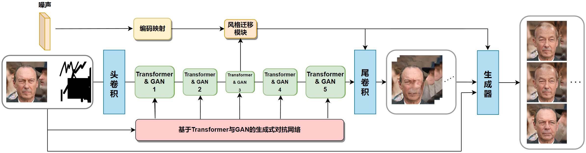

# 基于深度学习的图像修复算法（Transformer、GAN）

## :sparkles: 人脸修复Demo


## :sparkles: 建筑&风景修复Demo

- 稍后上传

## :sparkles: 网页端效果展示

👇
**Web端在线体验地址：**:white_check_mark:[图像修复在线体验链接](https://qh880639rv62.vicp.fun/):white_check_mark:
PS：用于人脸修复的数据集在这里下载（也可以换用其他的，但使用CelebA-HQ中的4万张图进行测试效果最好）

```
百度网盘分享的文件
链接：https://pan.baidu.com/s/1f8v6-OQsK_6YHvlvTvovGQ?pwd=khgb 
提取码：khgb
```

PS：用于图片修复的Mask在这里下载（必须使用Mask，Mask的作用是告知模型图片破损的位置）

```
百度网盘分享的文件
链接：https://pan.baidu.com/s/1Det77BagB6Xm3LdKG1_JFA?pwd=zz1k 
提取码：zz1k
```

👆


<hr>


### 研究背景

&emsp;&emsp;在图像获取和传输过程中，往往伴随着各种形式的损坏，降低了图像质量和对图像信息的准确解释，一些老照片因为保存不当也会变得存在污渍或者破损缺失。图像修复技术主要用来修复日常生活中被噪声污染或者人为破坏的破损图像，也可应用于替换图像中的小区域或者瑕疵。目前，图像修复工作仍然由经验丰富的图像修复师来完成，让图像修复借助深度学习算法实现自动化日趋成为该领域的发展方向。本课题基于深度学习算法和图像处理技术，设计并开发一款图像修复深度学习算法程序，该算法能够对使用者上传的照片进行自动化分析，修复照片的损坏部分，提高照片的清晰度和观赏性。

### 介绍

&emsp;&emsp;最近的研究表明，在图像修复问题中建立远程相互作用模型具有很高的重要性。为了实现这一目标，现有的方法要么利用独立注意力技术，要么利用Transformer。但是，考虑到计算成本，并且通常需要修复低分辨率下的图像。本课题提出了一种新的基于Transformer的图像修复模型，该模型能够有效处理高分辨率图像。具体来说，本课题设计了一个面向预测像素的Transformer结构模型，结合卷积的上下采样和图像风格迁移技术来实现缺失或者模糊图像的修复。
&emsp;&emsp;该模型由以下几个主要部分组成：卷积头、Transformer、卷积尾和风格迁移模块。 卷积头负责从输入图像和掩码中提取视觉标记。它包括四个3*3卷积层，用于更改图像维度和下采样。Transformer是模型的主要组成部分，由五个不同分辨率的Transformer组成。使用多头情境注意力对长距离互动进行建模。 卷积尾用于对输出标记的空间分辨率进行上采样以匹配输入大小。风格迁移模块旨在实现多元化生成并增强输出的多样性。它通过使用额外的噪声输入在重建过程中更改卷积层的权重归一化来操纵输出。该模块还结合了图像条件样式和无噪声样式，以增强噪声输入的表示能力。



<hr>


### 运行要求

- 运行算法与Web前端需要 Python >= 3.8
- 运行GUI界面需要下载QT编译器 5.14.2 版本

### 📌通过运行算法源代码获取检测结果

#### 环境配置

#### 使用conda安装环境

```
# Clone项目
git clone https://github.com/zxx1218/image_fix.git
# 使用conda创建环境
conda create -n imgfix python=3.8
conda activate imgfix 
# 安装依赖
pip install -r requirements.txt 
```

### 测试图片

#### 方式一：启动Web端交互界面

 启动web端（会启动在127.0.0.1:xxxx的本机环回地址下)

```
python gradio_demo.py
```

#### 联系作者：

- VX：Accddvva
- QQ：1144968929
- **该项目代码提供训练好的模型文件以及调用该文件进行修图的测试代码（clone后安装环境即可使用，开源版不包含模型源码以及gui）**
- 本项目完整代码+环境配置教程+代码使用方式+GUI界面 == **价格300RMB，可提供远程部署服务**

<hr>


### 模型演示：

#### 通过QT的GUI界面演示图像修复

- 由于github上传视频受限，观看演示视频请移步至我的csdn，连接：https://blog.csdn.net/qq_45566099/article/details/134942373
- **2024.4.15QT界面已经升级到V2.0版本，提供了内嵌的sellite轻量级数据库支持（无需配置版的数据库）以及GUI界面的美化，并添加了历史记录查询功能。**

#### 访问Web进行图像修复

- 在线体验地址：稍后公开
- 由于github上传视频受限，观看演示视频请移步至我的csdn，连接：https://blog.csdn.net/qq_45566099/article/details/134942373

#### 通过控制台（终端）直接调用模型演示图像修复：

- 由于github上传视频受限，观看演示视频请移步至我的csdn，连接：https://blog.csdn.net/qq_45566099/article/details/134942373

<hr>

### 训练用数据集

- **人脸**公开数据集**CelebA-HQ**：链接：https://github.com/tkarras/progressive_growing_of_gans
  制作机构：Tero Karras, Samuli Laine, Timo Aila 和 NVIDIA 的研究人员制作
- **场景**公开数据集**Places2**：链接：http://places2.csail.mit.edu/download.html
  制作机构：斯坦福大学和微软研究院共同制作
- **街景**公开数据集**Paris StreetView**：链接：http://opendata.paris.fr/explore/dataset/photos-de-rue-a-paris/
  制作机构：巴黎市政府
- **文理**公开数据集**DTD**：链接：http://www.robots.ox.ac.uk/~vgg/data/dtd/。
  制作机构：英国牛津大学计算机视觉研究团队
- **建筑**公开数据集**Façade**：链接：
  GitHub上的项目：https://github.com/shannontian/facade-parsing
  官方网站：CMP Facade Database
  数据集共享平台：https://www.vision.ee.ethz.ch/datasets_extra/facade/
  制作机构：Czech Technical University in Prague (捷克技术大学)

<hr>

#### 广告

- 作者于浙江某985高校就读人工智能方向研究生，可以帮忙定制设计模型，并提供源代码和训练后的模型文件以及环境配置和使用方法，只需要描述需求即可。
- 人工智能领域，尤其是计算机视觉（Computer vision，CV）方向的毕业设计，只要你想得出，没有做不出的
