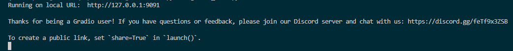

<h1><center>基于深度学习技术（生成对抗网络GAN与Transformer）的专一或多类别图像修复算法（含GUI+Web端在线体验界面）</center></h1>

### 如果要做老照片像素清晰化，划痕修复，请参考这篇CSDN作品👇

[计算机毕业设计--基于深度学习的图像修复（清晰化+划痕修复+色彩增强）算法设计与实现（含Github代码+GUI+Web端在线体验界面）](https://blog.csdn.net/qq_45566099/article/details/136506388)

### 如果您想对灰度图片进行上色，或是老照片的色彩复原，请参考这篇CSDN作品👇

[计算机毕业设计-基于深度学习的老(旧)照片色彩复原、上色算法模型设计与实现（对抗生成式网络GAN、含Github代码与Web端设计）](https://blog.csdn.net/qq_45566099/article/details/138611013)

<h3>更多基于深度学习的毕业设计请关注专栏 --- <a href="https://blog.csdn.net/qq_45566099?type=blog">深度学习相关计算机毕业设计</a></h3>

<hr>


## :sparkles: 人脸修复Demo（模型训练基于CelebA-HQ数据集 - 4万张图）


## :sparkles: 建筑&风景修复Demo（模型训练基于Places2数据集 - 180万张图）

- 作者正忙，稍后上传

<hr>

## :sparkles: 图像修复在线体验

👇

 **Web端在线体验地址：**:white_check_mark:[访问这里进行图像修复在线体验](http://qh880639rv62.vicp.fun):white_check_mark:

**在线体验地址已经集成了训练好的模型，您只需点击选择使用的模型即可！**

☝


### 图像修复论文开题报告&&任务书

&emsp;&emsp;**提示：** 本科生做深度学习毕业设计是比做一个系统更容易通过答辩与毕业的，学校对本科生掌握深度学习知识的程度不高，只需要能大致讲述出模型的设计流程，并在论文中写清楚即可。

&emsp;&emsp;另外，本科生做深度学习的项目一般不能纯做算法（因为老师清楚本科生并不具备单独研究算法的能力），所以应该以算法+应用为主，因此一定需要一个为算法配套的可视化交互程序（Web端或者GUI桌面应用程序）。该项目设计了GUI和Web页面两种配套应用，一般来说，选择其一就可以。

**本项目提供该项目可用的开题报告与任务书供免费下载使用（开题报告不查重）**

:package:：**图像修复论文可用开题报告`&&`任务书下载链接：**

```
通过网盘分享的文件：破损图像修复开题报告&&任务书.doc
链接: https://pan.baidu.com/s/1k7P5HQtDLqw1plzNBCQ3WQ?pwd=jkbb 提取码: jkbb
```


<hr>

**在线体验使用方式：**

&emsp;&emsp;打开连接后，左侧两个图片输入框分别需要上传待修复的原图和代表原图上破损位置的Mask。**在网页下方提供了四组输入样例，点击样例自动填充到相应位置后即可点击开始修复查看效果。**

**注意：** 修复第一张图的时候耗时较长，大约10秒左右。从第二张图开始，速度就会快起来，大约5秒左右一张（这主要是因为为了节约服务器资源，第一次启动的时候模型需要加载进显卡中）


<hr>


## 模型研究背景
&emsp;&emsp;近年来，相关研究表明在处理图像修复问题时构建能够捕捉远程相互作用的模型至关重要。这一能力对于恢复图像的完整性和细节起着关键作用。为了达成这一目标，目前已有的方法主要分为两类：一类是借助传统的数字图像处理技术，这类技术虽然历史悠久，但在应对现代复杂图像时存在一定的局限性；另一类则是采用单一且结构相对简单的卷积神经网络（`CNN`）架构。然而，无论是传统技术还是简单的`CNN`结构，在处理低分辨率的复杂图像时，都显得捉襟见肘，难以达到理想的修复效果。

&emsp;&emsp;针对上述挑战，本课题创新性地提出了一种全新的图像修复模型。该模型巧妙地融合了对抗生成网络（`GAN`）和`Transformer`架构的优势，能够有效地对各种分辨率下的复杂图像进行精准修复。通过这种融合，模型不仅能够捕捉图像中的长距离依赖关系，还能生成高质量的修复结果，为图像修复领域提供了一种更强大、更有效的解决方案。 

## 模型结构设计
&emsp;&emsp;本研究构建的图像修复模型创新地融合了`GAN`和`ViT`技术，采用受`U-Net`启发的`U`形架构。骨干网络的不同层级承担不同功能，第1、2层作为生成器，负责从输入图像中提取特征并进行下采样；第4、5层充当判别器，执行上采样操作以恢复图像细节。而第3层是模型的关键创新点，它集成了`ViT`的编解码器和多头注意力机制，借助自注意力机制整合不同位置的特征，使模型对图像全局信息的理解能力大幅增强，能够有效捕捉长程依赖关系。同时，模型运用`resnet-18`对原始图像进行特征提取，降低了`ViT`编码解码器的计算负担，在减少计算量的情况下保留主要特征，之后将处理后的特征输入由`ViT`结构构成的`U-Net`变体中进行后续处理。 

&emsp;&emsp;为进一步提升模型性能，本模型还引入了风格迁移模块。该模块在`GAN`的对抗学习过程中，通过额外的噪声输入改变卷积层权值归一化，从而影响模型输出，使模型在学习过程中更好地区分噪声和有效图像特征，增强泛化能力。在模型训练环节，采用非饱和对抗损失函数替代传统的损失函数，避免对误差的同等对待，更关注大误差情况，优化模型训练过程，最终实现图像修复质量和效果的提升。 

## 交互系统开发
&emsp;&emsp;该项目基于训练完成的模型，开发了**两种**不同的交互系统界面。分别是可打包为`.exe`文件的基于`QT`开发的`GUI`界面（如下图所示），以及一个`Web`前后端项目（**Web端样式同在线体验连接**）。


## 模型性能指标测试
- 包括`SSIM（Structural Similarity）`结构相似性指标、`PSNR（Peak signal-to-noise ratio） `峰值信噪比、`PID`、`UID`指标以及训练过程中`Acc`和`Loss`的评估。如果你是在私有数据集上训练的模型，那么上述测试数据需要在自己训练过的模型上才能完成指标测试，相关测试请联系作者（联系方式见文末）


<hr>


  ## :rocket: 运行要求

- 运行算法与Web前端需要 `Python >= 3.8`
- 运行GUI界面需要下载Qt Create编译器 `5.14.2` 版本
- 我提供在 `CelebA-HQ` 和 `Places2` 数据集训练好的两个模型，建议使用带有Nvidia（英伟达）系列的显卡（例如常见的GeForce 1060、3050、3090、4090、5060等都是Nvidia系列的）
- **如果电脑没有合适的显卡也可使用该模型（需通过内存加载模型并丢给CPU进行推理计算，推理速度会慢很多）**


:package:：训练人脸修复模型的数据集`CelebA-HQ`在这里下载（也可以换用其他图片进行测试，但选择使用数据集中的4万张图进行测试效果最好）

```
百度网盘分享的文件
链接：https://pan.baidu.com/s/1f8v6-OQsK_6YHvlvTvovGQ?pwd=khgb 
提取码：khgb
```

:package:：用于辅助图片修复的Mask在这里下载（必须使用`Mask`，`Mask`的作用是告知模型图片破损的位置）

```
百度网盘分享的文件
链接：https://pan.baidu.com/s/1Det77BagB6Xm3LdKG1_JFA?pwd=zz1k 
提取码：zz1k
```

<hr>


  ## :zap:模型所需环境配置及使用方法（Windows / Linux 均适用）

  ### 环境配置

#### 方式一：使用conda安装环境

  ```
# 从github上Clone项目（需要你安装了git工具）
git clone https://github.com/zxx1218/image_fix.git

# 使用conda创建环境
conda create -n imgfix python=3.8
conda activate imgfix 

# 安装依赖
pip install -r requirements.txt 
  ```

#### 方式二：使用Docker

```
# 联系作者咨询，联系方式在文末
```

<hr>


### 算法模型使用（包括软件界面及控制台命令）

#### 方式一：启动Web端应用（Web端框架自带移动端页面自适应）

 **\* 效果同上述在线体验连接**

 部署好项目后启动`web`端使用如下命令（会启动在`127.0.0.1:xxxx`的本机环回地址下，图中示例为9091端口)

  ```
python gradio_demo.py
  ```

回车后会自动启动Web服务，在控制台看到如下信息代表成功启动，在浏览器打开弹出的URL即可👇

  

**注：项目也支持进行基于Python的FastApi后端服务部署（针对Web服务器部署）。如有需要，联系作者，联系方式在文末**


#### 方式二：启动基于QT的桌面应用（支持打包发布为桌面.exe可执行文件）

使用Qt Create编译器运行QT代码即可直接使用（SQLlite数据库为代码内嵌，无需特别配置），启动后首先经过注册与登录界面，登录后效果如下图

- 上传mask位置有用户选择mask后，会自动覆盖在原图上，并显示为原图覆盖mask后的结果）
- 设计了根据不同登录用户的用户历史修图记录查询功能


#### 方式三：大批量图像批量修复（通过控制台 / cmd / 终端）

  执行如下命令：

```
# 首先cd到算法代码imf_fix根目录下
cd img_fix

# 将待修复图片放在文件夹/test_sets下
（略）

# 执行generate_image.py文件（这里需要根据您的修复需求添加相关参数）
python generate_image.py --参数1 --参数2 --参数n
```

控制台显示如下日志信息代表批量修图成功👇

  

  <hr>


  ## 算法模型使用演示视频（桌面应用 & Web前端 & 控制台）

  ### 1. 通过GUI进行图像修复

  视频中上传的黑白图中黑色部分代表图片的破损位置（V2.0版本中上传的mask会覆盖在原图上进行显示。视频中演示的是V1.0版本），模型会将黑白图完全覆盖在原图上通过未破损位置对破损位置进行修复

  - 由于github上传视频受限，观看演示视频请移步至我的CSDN观看，连接：https://blog.csdn.net/qq_45566099/article/details/134942373

**PS：2025.2.26 QT界面已经升级到V2.0版本，提供了内嵌的sellite轻量级数据库支持（使用无需额外配置）以及GUI界面的美化（主要为mask上传后显示为在原图上的覆盖），并添加了用户历史修图记录查询功能。**


  ### 2. 访问Web进行图像修复

Web端在线体验地址： :white_check_mark: [访问这里进行图像修复在线体验](http://qh880639rv62.vicp.fun):white_check_mark:

  - 由于github上传视频受限，观看演示视频请移步至我的CSDN观看，连接：https://blog.csdn.net/qq_45566099/article/details/134942373


  ### 3. 通过控制台（cmd \ 终端）直接调用模型进行图像批量修复（一次性修复若干张图）：

  - 由于github上传视频受限，观看演示视频请移步至我的CSDN观看，连接：https://blog.csdn.net/qq_45566099/article/details/134942373

  <hr>


  ## :wrench:	如何自己训练模型?

- 训练自己想要的定制化图像修复模型**只需要准备好针对需要修复图片的同类型图片数据即可**，具体训练方式请咨询作者

<hr>

##  :star:作者联系方式：

- `VX：Accddvva`
- `QQ：1144968929`

- Github提供训练好的模型文件以及调用该文件进行修图的测试代码（**Github开源代码中不含模型定义源码、训练代码以及QT的桌面端GUI代码，提供可供测试的模型文件，拉取Git代码后安装环境可进行修图测试**）
- 该项目完整代码 + 详细环境配置（如有需要可提供模型远程部署）+ GUI界面 + Web端 + 训练方式 == 价格300RMB
- 如果你的电脑没有合适的GPU，或需要自行训练私有数据而自己的GPU显存不够，作者另提供GPU服务器短期（3个月内）免费使用服务，免费提供24G显存+64G内存云服务器（可使用Vscode、OpenSSH、PuTTY、Xshell、SecureCRT、MobaXterm等远程工具连接）

<hr>


## 一些模型训练可用的公开数据集

- **人脸（提供训练过的模型文件）**公开数据集**CelebA-HQ**：
  
  链接：https://github.com/tkarras/progressive_growing_of_gans

  制作机构：Tero Karras, Samuli Laine, Timo Aila 和 NVIDIA 的研究人员制作-内含约4万张训练图片
  
- **自然场景（提供训练过的模型文件）**公开数据集**Places2**：
  
  链接：http://places2.csail.mit.edu/download.html
  
  制作机构：斯坦福大学和微软研究院共同制作-内含180万张训练图片
  
- **街景**公开数据集**Paris StreetView**：
  
  链接：http://opendata.paris.fr/explore/dataset/photos-de-rue-a-paris/
  
  制作机构：巴黎市政府
  
- **文理**公开数据集**DTD**：
  
  链接：http://www.robots.ox.ac.uk/~vgg/data/dtd/。
  
  制作机构：英国牛津大学计算机视觉研究团队
  
- **建筑**公开数据集**Façade**：
  
  链接：https://github.com/shannontian/facade-parsing
  
  官方网站：CMP Facade Database
  
  数据集共享平台：https://www.vision.ee.ethz.ch/datasets_extra/facade/
  
  制作机构：Czech Technical University in Prague (捷克技术大学)


<hr>


## 广告

- 作者于浙江某985高校就读人工智能方向研究生(CSDN已认证)，可以定制模型，并提供相应技术文档以及各种需要，只需要描述需求即可
- 人工智能、深度学习领域，尤其是计算机视觉（Computer vision，CV）方向的模型or毕业设计，只要你想得出，没有做不出
